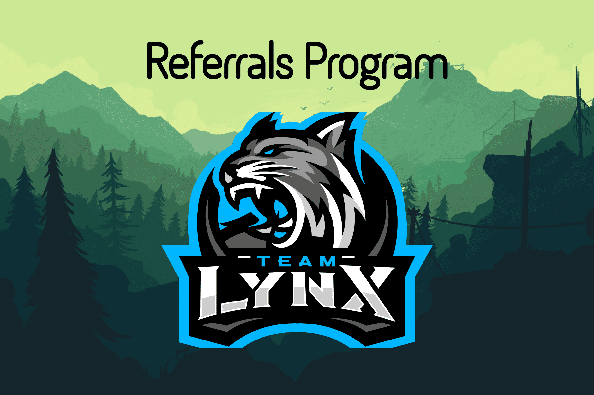

LYNX DEFI 是建立在 BSC 上的下一代 ANTIBOT 和抗通缩收益农场
现在加入我们：https://t.me/LynxDefi
☁️暂定时间表🌊
⏰发布 - 2021 年 6 月 12 日星期六 1600 GMT
https://countingdownto.com/?c=3653831
⏰农场 - 2021 年 6 月 13 日星期日 0400 GMT
https://bscscan.com/block/countdown/8251590
🌏代币经济学🌏
🍉首发价格：$2
🍉LYNX的初始供应：500
🍒安全🍎
没有迁移代码✅
限时合约✅
将被审查✅
所有初始流动性将被烧毁✅
🌶🌶特点🌶🌶
🌽下一代反机器人
🍆推荐系统🍆
  自动流动性添加
  自动转让税燃烧
🥞自动减排
电报群：https://t.me/LynxDefi
推特：https://twitter.com/defi_lynx
Reddit：https://www.reddit.com/r/LynxDefi/
Github：https://github.com/LynxDefi

