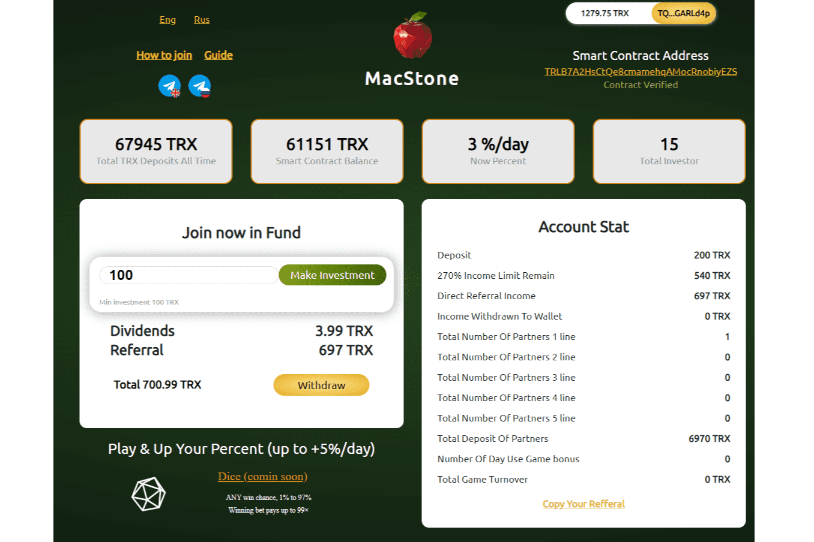

---
title: "MacStone"
description: "分散的、100% 公平的投资平台，具有经过验证的智能合约代码。赚取 + 270%（包括您的存款）TRX！"
date: 2022-08-17T00:00:00+08:00
lastmod: 2022-08-17T00:00:00+08:00
draft: false
authors: ["boogArno"]
featuredImage: "macstone.png"
tags: ["High risk","MacStone"]
categories: ["nfts"]
nfts: ["High risk"]
blockchain: "TRON"
website: "https://macstone.fund/"
twitter: ""
discord: ""
telegram: "https://t.me/macstoneeng"
github: ""
youtube: ""
twitch: ""
facebook: ""
instagram: ""
reddit: ""
medium: ""
steam: ""
gitbook: ""
googleplay: ""
appstore: ""
status: "Live"
weight: 
lightgallery: true
toc: true
pinned: false
recommend: false
recommend1: false
---
投资条款

💼 基本利率：每 24 小时 + 3%（每小时 + 0.125%）
🍰 合约总金额奖励：平台地址余额每5,000,000 TRX + 0.1%
🎰 通过在网站上玩游戏，您可以获得 7 天 + 5% 的奖金：每 10,000 TRX 营业额 + 0.1%
💵 总收入：270%（包括押金）
推荐计划
👤 10% 来自您推荐的存款
👥 推荐人每次付款的5级推荐佣金：15% - 12% - 9% - 6% - 3%

