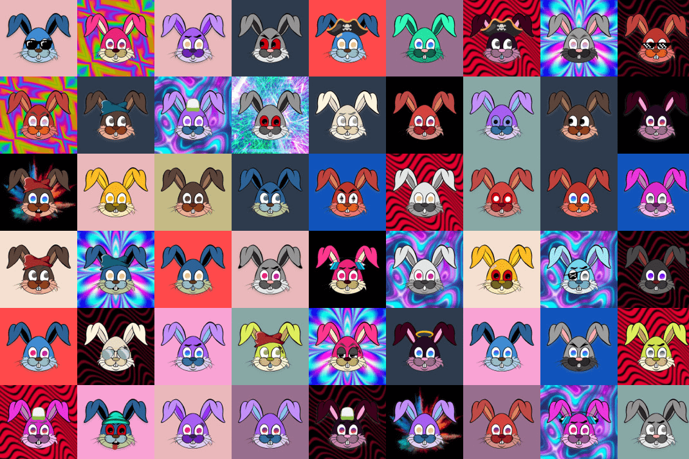

---
title: "MadBunnies"
description: "MadBunnie 是币安智能链上的 NFT 收藏品."
date: 2022-08-17T00:00:00+08:00
lastmod: 2022-08-17T00:00:00+08:00
draft: false
authors: ["boogArno"]
featuredImage: "madbunnies.png"
tags: ["Collectibles","MadBunnies"]
categories: ["nfts"]
nfts: ["Collectibles"]
blockchain: "BSC"
website: "https://www.themadbunnies.com/"
twitter: ""
discord: ""
telegram: "https://t.me/madbunnies"
github: ""
youtube: ""
twitch: ""
facebook: ""
instagram: ""
reddit: ""
medium: "https://madbunnies.medium.com/"
steam: ""
gitbook: ""
googleplay: ""
appstore: ""
status: "Live"
weight: 
lightgallery: true
toc: true
pinned: false
recommend: false
recommend1: false
---
MadBunnies 是 10,000 个很酷的全新手绘和计算机生成的 NFT，您可以购买、拥有和交易！独家在币安智能链上。
🔹限量10,000！
🔹 各大平台上市
🔹 与 BSC NFT 的顶级市场合作
🔹 从第一天开始营销
🔹 每日 BUSD 和 MadBunny 赠品！
附加信息：

- 网站上的价格图表
- Mint 的起始价格为 0.01 BNB
- 在 BSCScan 上验证的合同
- 为团队/赠品保留的前 10 个 MadBunnies
- 将捐赠 % 的 BNB 来帮助对抗世界饥饿！
- 