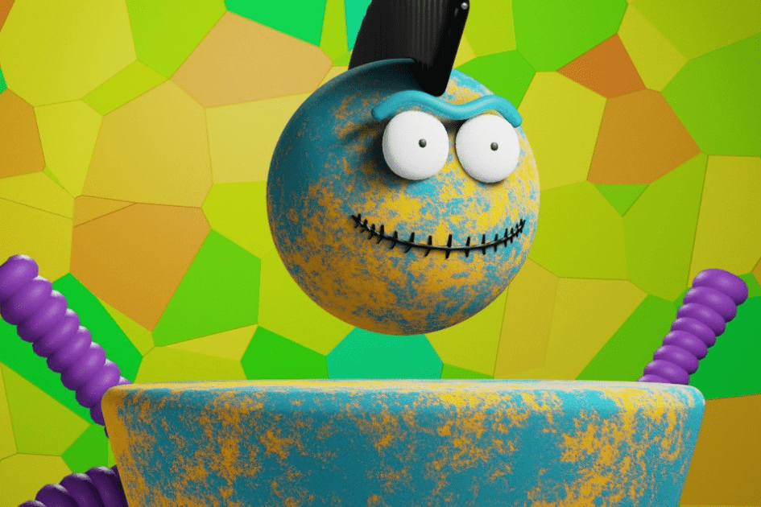

---
title: "MadGum"
description: "“OG Custies”我们的创世纪系列，包含 6000 个可定制的独特角色。
我们的目标是打造小游戏平台"
date: 2022-08-17T00:00:00+08:00
lastmod: 2022-08-17T00:00:00+08:00
draft: false
authors: ["boogArno"]
featuredImage: "madgum.png"
tags: ["NFT Games","MadGum"]
categories: ["nfts"]
nfts: ["NFT Games"]
blockchain: "Polygon"
website: "https://madgum.io/"
twitter: "https://twitter.com/MadGum_"
discord: "http://discord.gg/kUk7punWMb"
telegram: "https://t.me/madgum"
github: ""
youtube: ""
twitch: ""
facebook: ""
instagram: ""
reddit: ""
medium: ""
steam: ""
gitbook: ""
googleplay: ""
appstore: ""
status: "Live"
weight: 
lightgallery: true
toc: true
pinned: false
recommend: false
recommend1: false
---
OG Custies”我们的 6000 个可定制和独特角色的起源集合，存储在 Polygon 区块链上并托管在 IPFS 上我们的目标是推出小游戏平台，玩家可以在其中收集对手的 NFT。 OG 持有者将获得空投、赠品和抢先体验等福利。
该数据代表被跟踪智能合约的原始链上活动

