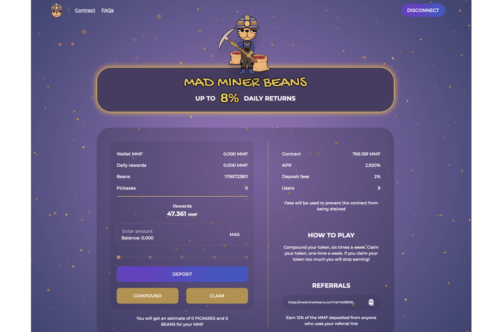

MadMinerBeans 与其他矿工不同，这要归功于用于回购的低费用以延长平台的使用寿命，并且因为它使用 MMF，这是整个 cronos 链中拥有最大社区的代币。
用户积累更多的$MMF代币，可以选择复利或索取，每日奖励高达8%
该合约经过验证、开源、不可变、值得信赖，并且在 https://cronoscan.com 上可见
力学：
1. 存入您的 $MMF 代币
2. 每天复利6天...
3. 第 7 天索赔
4.享受前所未有的复合效应和潜在的无限被动收入
我们的费用如下：
2% 的存款费用
4. 