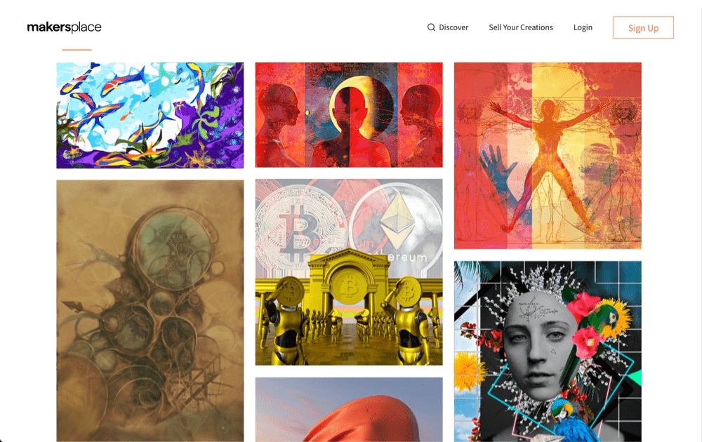

---
title: "MakersPlace"
description: "MakersPla 提供的每一个数字创作"
date: 2022-08-17T00:00:00+08:00
lastmod: 2022-08-17T00:00:00+08:00
draft: false
authors: ["boogArno"]
featuredImage: "makersplace.png"
tags: ["Collectibles","MakersPlace"]
categories: ["nfts"]
nfts: ["Collectibles"]
blockchain: "ETH"
website: "https://makersplace.com/"
twitter: "https://twitter.com/makersplaceco/"
discord: "https://discordapp.com/invite/TXs8tZD/"
telegram: ""
github: ""
youtube: ""
twitch: ""
facebook: "ttps://www.facebook.com/makersplaceco"
instagram: "https://www.instagram.com/makersplaceco/"
reddit: ""
medium: ""
steam: ""
gitbook: ""
googleplay: ""
appstore: ""
status: "Live"
weight: 
lightgallery: true
toc: true
pinned: false
recommend: false
recommend1: false
---
通过 MakersPlace 提供的每一个数字创作都是真实且真正独特的数字创作，由创作者签名和发布 - 由区块链技术实现。即使数字创作被复制，它也不会是真实的原始签名版本。