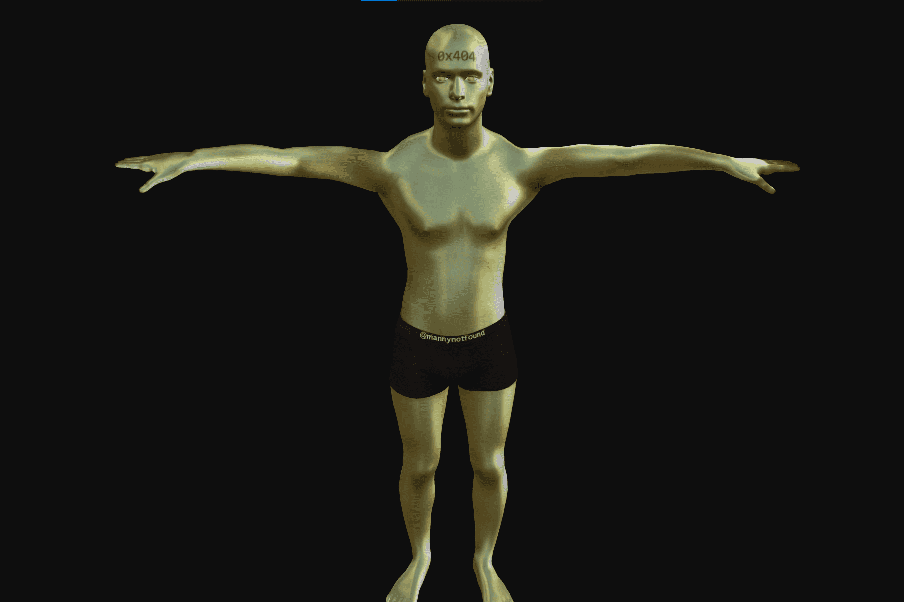

mannys.game 的目标只是铸造“The Golden Manny”，它在以太坊区块链上的 ERC721 合约中作为代币 id 404 存在。
铸造 The Golden Manny 的唯一方法是在合约中调用 mintGoldManny()，同时拥有每种稀有 Manny 的 1 个。在 1616 个总供应量中，有 7 个由代币 ID 1-403 表示的稀有曼尼。每一个稀有曼尼都带有一个序列号和特殊的皮肤类型，类似于现代追逐运动卡。 Mannys 可以以每个 0.1 ETH 的价格铸造，每个钱包最多可以铸造 64 个。
一旦玩家拥有了 The Golden Manny，他们就可以调用合约中的 winTheGame() 函数来赢得游戏并提取合约的以太坊余额（铸币销售额的 60%）。合同将存储获胜者的地址，本网站将更新以祝贺获胜者。
在合约发布时，全套稀有 Mannys 将被铸造到一个保险库账户。这是为了防止游戏因恶意行为者而无法获胜的情况。令牌 ID #1 将被铸造到我的钱包中以供 Metaverse 使用。如果404天后没有人获胜，我会调用合约的withdraw函数并宣布游戏结束。

