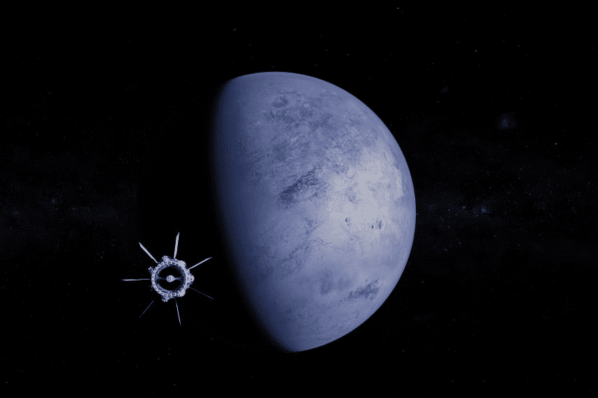

---
title: "MarsColony"
description: "MarsColony 是一个多行星殖民虚拟宇宙，具有独特的 NFT 土地所有权、基于 Defi 的流动性挖矿，并基于老式太空殖民游戏"
date: 2022-08-17T00:00:00+08:00
lastmod: 2022-08-17T00:00:00+08:00
draft: false
authors: ["boogArno"]
featuredImage: "marscolony.png"
tags: ["NFT Games","MarsColony"]
categories: ["nfts"]
nfts: ["NFT Games"]
blockchain: ""
website: "https://polygon.marscolony.io/"
twitter: "https://twitter.com/marscolonyio"
discord: "https://discord.gg/3ea9gH5H"
telegram: ""
github: ""
youtube: ""
twitch: ""
facebook: ""
instagram: ""
reddit: ""
medium: ""
steam: ""
gitbook: ""
googleplay: ""
appstore: ""
status: "Live"
weight: 
lightgallery: true
toc: true
pinned: false
recommend: false
recommend1: false
---
MarsColony 是一个火星殖民框架，它将视频游戏与 NFT 所有权、基于 DeFi 的经济、DAO 治理、行会和跨区块链殖民地相结合。
MarsColony 是 Harmony 上的顶级游戏项目之一。
现在我们正在向 Polygon 链上的新宇宙扩展，并向新玩家开放。
不要错过成为第一个组建 Polygon Colony 的机会！
加入我们的 Discord（添加在链接中）并继续关注。